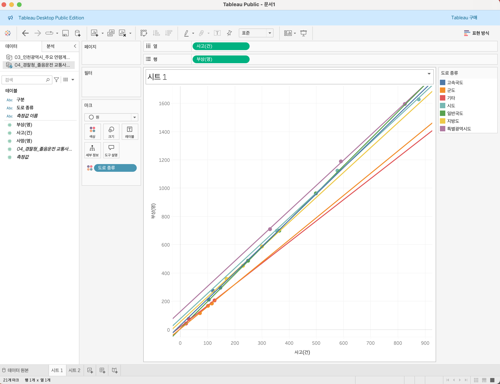

# 3 데이터 시각화 시작하기 차트 _ 차트 유형별 데이터 시각화 기법 알아보기

## 3-1 막대차트 
##### *비교 분석 중심 시각화*
> ## 상황별 막대차트 사용법
### 1. 막대 차트는 트렌드를 파악할 때 유용하다.
- 해마다 방문객이 얼마나 늘고 줄었는지 

### 2. 수직 막대 차트는 순위를 비교할 때 유용하다.
- 사원별 판매 대수 실적 순위

### 3. 수평 막대 차트는 달성도를 확인할 때 유용합니다.
목표치를 참조선으로 표현하면 더욱 효과적인 차트 만들 수 있다.

> ### TIP 막대 차트를 사용할 때 알아 두면 좋은 내용

### tip 1. 항목이 많다면 수평 막대 차트 이용

항목이 많거나 항목의 이름이 길때 수평이 수직보다 정돈되어 있다는 인상

### tip 2. 순위를 강조하고 싶다면 오름(내림)차순으로 정렬
정렬을 바꿔도 전달하려는 메시지가 달라지지 않을때만 정렬 사용해야함!
5개년도 방문객수 트렌드 볼때 연도 뒤죽박죽 처럼 되면 안됨

### tip 3. 항목을 구분해야 한다면 색상을 사용

> #  직접해보기
대구 지하철 총 승객수는 호선에 따라 어떤 차이가 있을까?
- 책에서는 서울이지만 대구로 약간 변경해서 사용

### 1. 데이터 준비하기
https://www.data.go.kr/data/15002503/fileData.do

2024.01.01 ~ 2025.01.31 까지 데이터라고 나와있지만 1월 밖에 없다..

### 2. 데이터로 알고 싶은 내용 질문하기

대구 지하철 어떤 역이 가장 이용객 수가 많은가?
1월에는 어떤가?
### 3. 태블로 시작하기
### 4. 막대차트 만들기
- 그라데이션 쓰는법 : 테이블을 색상에 드래그하면 된다.

### 5. 질문에 답해 보기

반월당2가 가장 사용이 많다
이유는? 2호선 환승역이기 때문일까?
왜일까

1, 5, 12, 19 등 일요일은 탑승객 현저히 적다

25~30은 설날 연휴 

29일은 설날 당일이었다.

## 3-2 선 차트
##### *시간에 따른 변화 중심의 시각화*
선으로 데이터를 표현하는 시각화 방법. 수익 변화와 같은 시기별 트렌드나 향후 예상 수익과 같은 미래에 변화할 값 예측하는 등 시간에 따른 데이터 변화를 파악할 때 효과적.

>## 상황별 선 차트 사용법
### 1. 선차트는 시간의 흐름에 따른 데이터 변화를 보여줄 때 유용하다.

### 2. 선 차트는 항목 간 트렌드 변화를 비교할 때 유용하다.

> ### TIP 선 차트를 사용할 때 알아 두면 좋은 내용

### tip 1. 핵심을 정확하게 전달하려면 한 차트에 너무 많은 선을 사용하지 말자

### tip 2. 항목을 차별화 하고 싶다면 색상을 사용하자

### 항목값이 과장되지 않도록 세로축 범위를 적절하게 조정하자

># 직접해보기
- ### 1단계 데이터 준비하기 

제공되는 Source 데이터 활용

- ### 2단계 데이터로 알고 싶은 내용 질문하기

**제주도 자연 휴양림 이용객 현황 데이터로 떠올려 볼 수 있는 질문**

> 방문객이 가장 많은 휴양림과 방문객이 가장 적은 휴양림은 어디인가?

> 휴양림별 이용객수의 차이가 있는가? 있다면 어떤 차이가 존재하는가?

> 휴양림별 방문객수 트렌드는 어떤가?

- ### 3단계 항목이 하나만 있는 선 차트 만들기
Tableau로 실습

제주 절물 자연 휴양림의 방문객수가 다른 휴양림과 비교했을때 압도적으로 많다.
이에 반해 상재거으로 다른 휴양림은 비슷한 방문객수 보이고 있음

트렌드 : 전반적으로 이용객이 줄고 있다

## 3-3 파이 차트
##### *비율 분석 중심의 시각화*

파이차트는 데이터의 구성 요소들이 전체 데이터에서 어느 정도의 비율을 차지하는지 파이 조각으로 보여 주는 시각화 방법 세부 항목간 비율을 분석할때 유용하다.

> ## 상황별 파이 차트 사용법

### 1. 파이차트는 항목의 비율을 파악할 때 유용하다.

### 2. 파이 차트는 항목 간 상대적 크기를 비교할 때 유용하다

> ## 파이차트를 사용할 때 알아 두면 좋은 내용

### tip 1. 핵심을 제대로 전달하려면 파이를 너무 많은 조각으로 나누지 말자
### tip 2. 크기를 명확하게 비교하려면 조각을 큰 순서대로 나열하자.
### tip 3. 정확한 정보를 보여 주고 싶다면 핵심 정보만 담아야 한다.

># 직접해보기
- ### 1단계 데이터 준비하기
예제파일 인천광역시_주요 연령계층별 추계인구 데이터 사용

- ### 2단계 데이터로 알고 싶은 내용 질문하기
**인천광역시 주요 연령계층별 추계인구 데이터로 떠올려 볼 수 있는 질문**
>시군구별 유소년 인구 구성비율은 얼마인가?

>인천광역시 시군구별 생산 연령 인국수와 고령 인구수는 어떤 차이를 보이는가?

>가장 낮은 인구 비율을 차지하는 시군구는 어디인가?

>인구 비율은 시군구별로 고르게 분포되어 있는가?

- ### 3단계 파이 차트 만들기

- ### 4단계 질문에 답해보기
Q. 시군구별 유소년 인구 구성 비율은 어떤가?

서구에서 가장 높은 인구비율을 보이고 서구,남동구,연수구가 전체 유소년 인구중 절반을 차지한다.

> #### 다양한 파이 차트로 질문에 답해 보기
Q. 인천광역시 시군구별 생산 연령 인구수와 고령 인구수는 어떤 차이를 보이는가?

고령 인구수 보여주는 파이차트 보다 생산 연령 인구수 보여주는 파이 차트가 더 크다

생산 연령 인구 보다 고령 인구수가 더 많다

생산 연령 인구수는 서구가 가장 많지만, 고령 인구수는 남동구가 가장 많다.

## 3-4 분산형 차트
##### *관계 분석 중심의 시각화*

가로축과 세로축으로 구성된 좌표에 점을 찍는 방법으로 항목 간 관계를 보여주는 차트, 서로 다른 2개의 항목 간 관계를 비교할 때 유용하다.

> ## 상황별 분산형 차트 사용법

### 1. 분산형 차트는 항목 간 관계를 확인할 때 유용하다.

### 2. 분산형 차트는 분포 양상을 비교할 때 유용하다.

> ### TIP 분산형 차트를 사용할 때 알아 두면 좋은 내용

- ### tip 1. 항목 간 관계를 명확하게 표현하고 싶다면 추세선을 사용

> # 직접해보기
졸음 운전 사고 건수는 사상자와 어떤 관계를 보일까?

- ### 1단계 데이터 준비하기
예제파일 경찰청 졸음운전 교통사고 현황 사용

- ### 2단계 데이터로 알고 싶은 내용 질문하기
**졸음운전 교통 사고 현황 데이터로 떠올려 볼수 있는 질문**

- 졸음운전 사고 건수와 사망자수는 어떤 관계가 있는가?
- 졸음운전 사고 건수와 부상자수는 어떤 관계가 있는가?
- 졸음운전 사고 건수 대비 사망자수는 도로 종류에 따라 어떤 특성을 보이는가?
- 졸음운전 사고 건수 대비 부상자수는 도로 종류에 따라 어떤 특성을 보이는가?

- ### 3단계 분산형 차트 만들기

- ### 4단계 질문에 답해보기 
Q. 졸음운전 사고 건수와 사망자수는 어떤 관계가 있는가?

A. 졸음운전 사고 건수와 사망자수 사이에는 양의 선형관계가 존재하긴 하나 연관성으 그리 크지 않다.

>고민해보기
Q1. 졸음 운전 사고 건수와 부상자수는 어떤 관계가 있는가?

A : 추세선 가파르고 선형관계

Q2. 졸음운전 사고 건수 대비 사망자수는 도로 종류에 따라 어떤 특성을 보이는가?

A : 고속국도, 군도, 일반국도, 지방도에서는 추세선 가파르다 , 하지만 데이터가 그리 많지는 않으므로 정확한 결론을 내리기는 어렵다.

Q3. 졸음운전 사고 건수 대비 부상자수는 도로 종류에 따라 어떤 특성을 보이는가?

A: 도로의 종류에 상관없이 졸음운전 사고 건수가 늘어날수록 부상자수도 함께 증가한다.

## 3-5 하이라이트 레이블
##### *데이터 포착 중심의 시각화*

> ## 상황별 하이라이트 테이블 사용법

### 1. 하이라이트 테이블은 여러 항목값 조합의 차이점을 비교할 때 유용합니다
### 2. 하이라이트 테이블은 주목해야 하는 값을 포착할 때 유용합니다 

> ## TIP 하이라이트 테이블을 사용할때 알아 두면 좋은 내용

### tip1. 의도를 명확히 보여 주는 색상을 사용하자.

3가지 색상 배합
- 정성형 배합 : 명확히 서로 구분되는 색상 배합

각 항목을 명확히 구분하고 강조할때 사용

- 순차형 배합 : 한 색상의 채도를 달리한 배합

데이터 간 변화를 매우 세밀하게 표현할 때 사용(그라데이션)

- 양방향 배합 : 대립하는 색상 배합

상반되는 항목값의 상대 척도를 보여 줄때 사용

### tip2. 보여 줘야 하는 조합의 개수가 많다면 조합값을 제거
색상이 있으니 숫자를 과감하게 제거하는 방법, 색상과 더불어 셀의 크기를 다르게 표현
(조합값을 제거한 하이라이트 테이블 : 히트맵 차트)

># 직접해보기 녹색기업은 녹색제품을 많이 구입할까?
Q. 발전소마다 연도별 제품 총구매액은 얼마인가?

A. 당진화력 발전소의 총구매액이 가장 높다.

동해화력 발전소는 본사와 비슷하지만 2018년에는 운영상 이슈가 있었던것으로 보인다.

> 고민해보기 다양한 하이라이트 테이블로 질문에 답해보기

Q1. 발전소마다 연도별 녹색제품 구매액은 얼마인가?

총 구매액과 유사하게 나타난다. 이를 바탕으로 제품 총구매액이 높으면 녹색제품구매액도 높다.

Q2. 발전소마다 연도별 녹색제품 구매비율은 어떤 차이를 보이는가?

A: 2018년도 당진화력 제외한 모두 100% , 2017,18,20년도 일산화력은 모두 녹색제품 구매비율 100% 이러한 노력으로 2020년 녹색기업 대상 수상하였다.

## 3-6 하이라이트 지도
하이라이트 테이블과 비슷하지만 지리적 데이터 분석에 초점이 맞춰져 있다.

> ## 상황별 하이라이트 지도 사용법
### 1. 하이라이트 지도는 데이터를 지리적으로 비교할 때 유용하다.
### 2. 하이라이트 지도는 시간별 지리적 데이터 변화를 확인할 때 유용하다.

> ## TIP 하이라이트 지도를 사용할 때 알아 두면 좋은 내용
### tip1. 시각화 효과를 극대화하려면 데이터에 맞는 지도 배경을 사용하자.
### tip2. 고유한 경로가 있는 데이터를 표현하려면 지도에 선을 사용하자.
고유한 경로가 있는 데이터를 선으로 이은 지도를 스파이더 지도 또는 기점-종점 지도라고 한다.

> # 직접 해보기 가품피해가 많이 발생하는 지역은 어디일까?
Q. 가뭄 피해 인구는 연도와 시도에 따라 어떤 차이를 보이는가?

<슬라이더 사용해서 동적으로 만들었음>

A : 가장 피해가 많은 지역은 강원도, 그 다음은 전라남도

가장 피해가 많이 발생한 지역은 전라남도.

>고민해보기 다양한 하이라이트 지도로 질문에 답해보기

Q1. 가뭄 피해 인구는 시군구에 따라 어떤 차이를 보이는가?

강원도 중에서 속초시의 가품 피해가 가장 많다. 빈도는 전라남도 완도군이 가장 많다

Q2. 가뭄 피해 인구는 피해 유형에 따라 지역별로 어떤 트렌드를 보이는가?