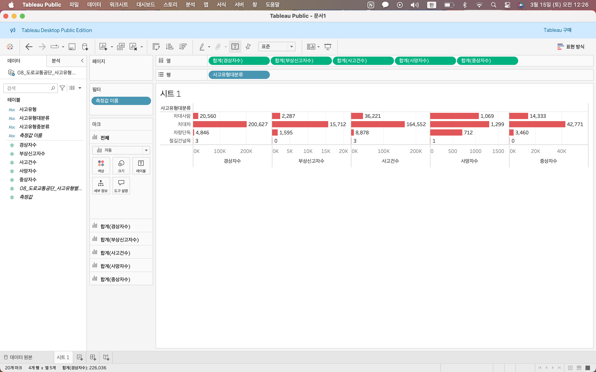
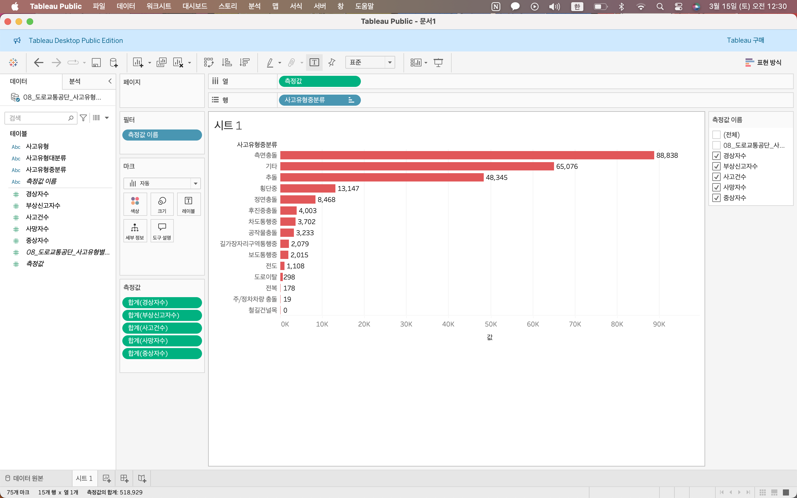
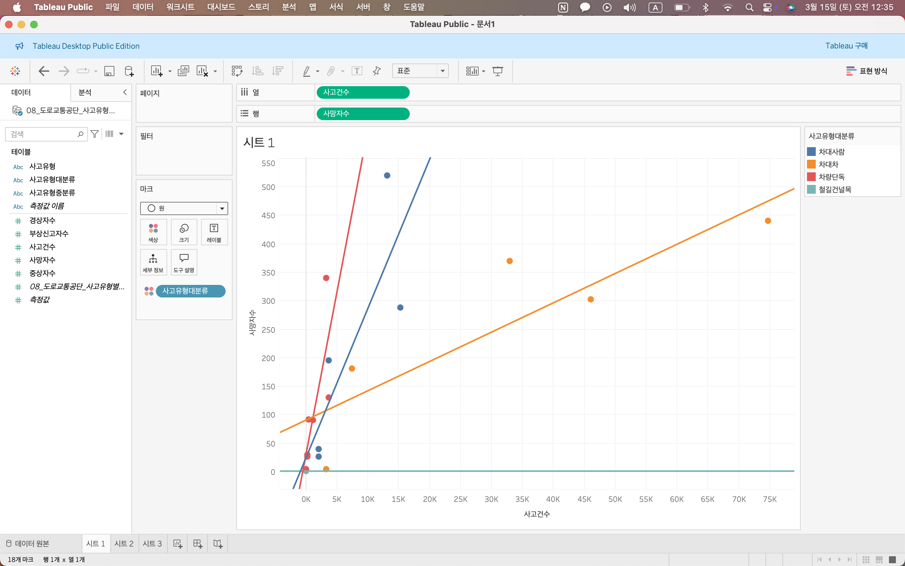
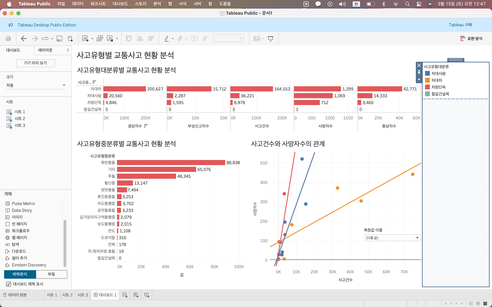
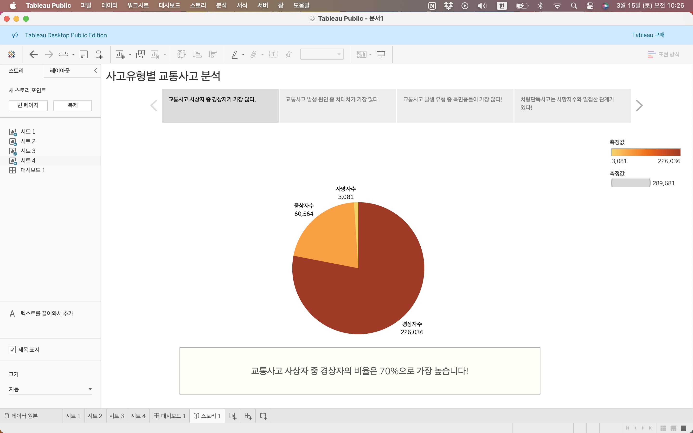
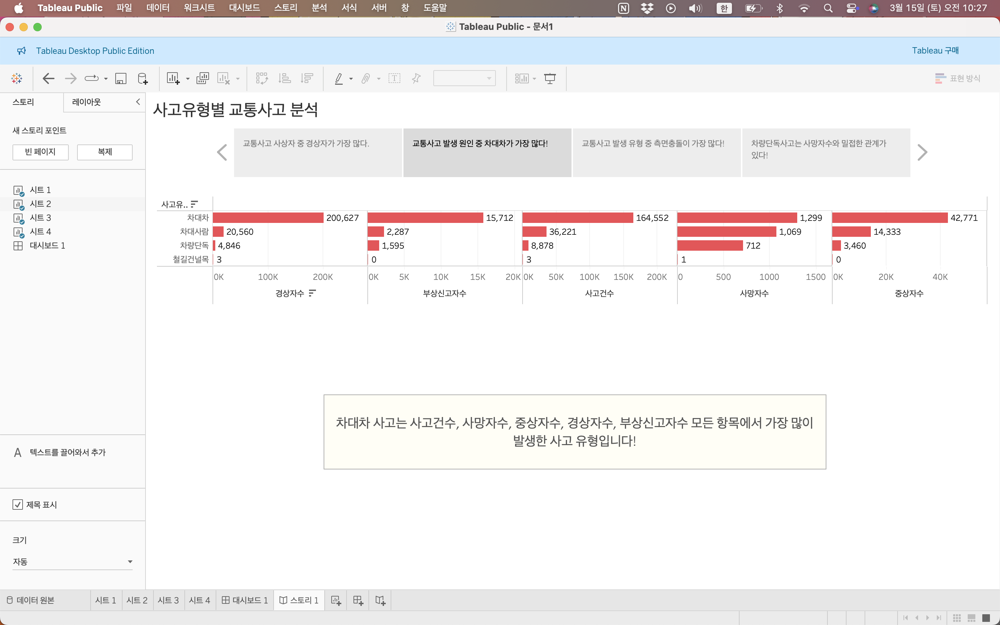
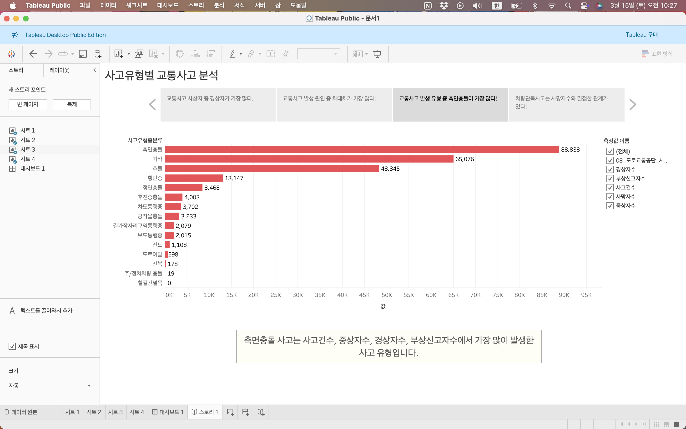
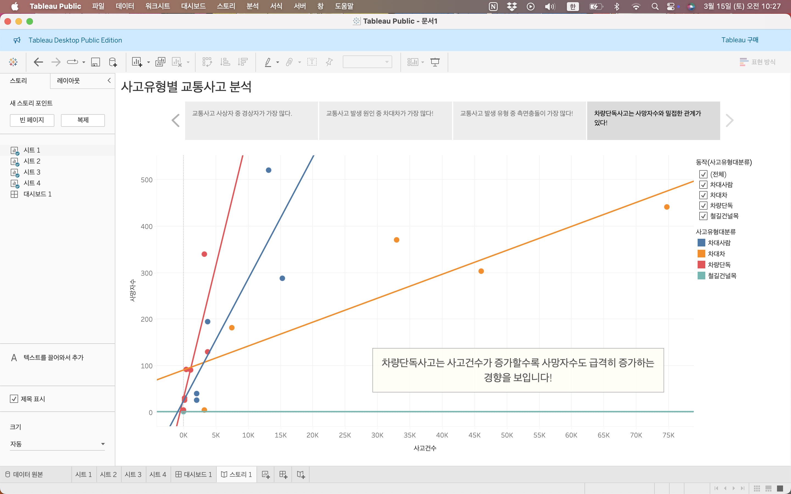

# 4. 데이터 시각화 끌어올리기_대시보드와 스토리 만들기

## 4-1 대시보드
다양한 정보를 한눈에 살펴보는 시각화 기법

데이터 시각화에서 말하는 대시보드는 자동차 계기판과 비슷한 개념으로 데이터 분석에 필요한 다양한 데이터와 차트를 쉽게 알아 볼 수 있도록 한곳에 모아둔 것으로 차트간 데이터를 유기적으로 연동할 수 있다.

### 대시보드의 장점
1. 시간과 장소에 구애받지 않고 데이터를 종합적으로 관찰하고 분석할 수 있다.

2. 트렌드를 쉽게 발견할 수 있다.

3. 합리적인 의사결정에 도움이 된다.

### TIP 대시보드를 만들때 알아두면 좋은 내용

#### tip1 대시보드로 해결할 문제와 보는 사람을 명확하게 설정하자.
근본적인 목적에서 벗어나 단순히 예쁘게 보이는 대시보드를 만들면 정작 중요한 메시지를 전달하지 못할 수도 있다.

1. 해결할 문제를 명확히 설정
2. 대시보드에 사용할 데이터를 선택
3. 대시보드를 보는 사람이 누구인지 구체적으로 파악
4. 이해관계자들이 대시보드로 얻을 수 있는 메시지가 무엇인지 생각.

#### tip2 가장 중요한 데이터를 위쪽이나 왼쪽 위에 배치

#### tip3 간결한 디자인으로 구성하자

- 색상은 중요한 데이터에만 사용하자
- 일관성 있는 글꼴을 사용하자
- 강조하고 싶은 데이터와 차트는 크게 보여준다.

#### tip4 관련 있는 데이터는 같은 곳에 모아두자

> ### 직접해보기 : 사고유형별 교통사고 현황 파악하기.

사고 유형 대분류별 교통사고 현황 그래프 완성!

Q: 사고 유형 중분류별 교통사고 현황은?

사고 유형 중분류별 교통사고 현황 그래프 완성!

Q : 사고유형대분류별 사고건수와 사망자수는 어떤 관계가 있는가?

관계 분석에 유용한 차트 - 분산형 차트

Q1 : 사고유형 대분류별 교통사고 현황은 어떻게 되는가?

A : 차대차 사고가 가장 많이 발생하며 차대사람 사고가 그 뒤를 따르고 있다. '사고건수와 사망자수의 관계' 차트까지 함께 살펴보면 차대차 사고는 사고건수 대비 사망자수가 비교적 낮으나, 차대사람 사고는 사고건수 대비 사망자수가 매우 높다.

Q2 : 사고유형 중분류별 교통사고 현황은 어떻게 되는가?

A : 사고건수, 중상자수, 경상자수, 부상신고자수는 측면충돌에서 가장 높다. 반면 사망자수는 측면충돌보다 기타 상황에서 가장 높다

Q3 : 사고유형 대분류별 사고건수와 사망자수는 어떤 관계가 있는가?

A : 차량단독 사고에서 사고건수가 증가할수록 사망자수가 급격하게 증가한다. 차대 사람 사고에서 역시 함께 증가한다.

## 4-2 태블로 스토리
설득력 있는 메시지를 전달하는 기법

> ### 태블로 스토리의 장점
태블로에서는 스토리라는 기능으로 데이터 스토리텔링 과정을 지원한다.

> ### TIP 7가지 데이터 스토리텔링 표현 방법

#### 방법 1 시간대별 변화
시간의 흐름에 따른 데이터의 변화를 강조하는 스토리텔링 표현 방법

#### 방법 2 드릴다운
큰 항목부터 시작해 세부 항목을 하나씩 살펴보는 방법

#### 방법 3 축소

다른 사람이 공감할 만한 소소한 내용에서부터 시작해 그것이 어떻게 큰 문제와 연결되는지 점진적으로 설명.

#### 방법 4 대조 
보여주려는 데이터를 다른 데이터와 비교해서 다른 사람의 이해와 공감을 이끌어 내는 스토리텔링 표현 방법.

#### 방법 5 교차
특정 항목의 수치가 다른 항목의 수치를 넘어서면서 발생하는 변화를 강조할 때 사용하는 방법.

#### 방법 6 요소

전달하려는 메시지를 카테고리로 나눠서 설명하는 방법.

#### 방법 7 이상값

비정상적이거나 상대적으로 확연한 차이를 보이는 항목값의 특성을 강조하는 스토리 표현 방법.

> ### 직접 해보기 사고유형별 교통사고 현황 발표하기

1. 교통사고 경상자, 중상자, 사망자 비율 :

우선 파이차트로 사고유형에 관계없이 전체 교통사고 사상자 중 경상자가 70% 이상을 차지한다는 사실 전달. 

2. 사고유형별 교통사고 현황 :

다음으로 수평막대 차트로 차대차 사고가 가장 많이 일어난다는 메시지를 전달, 그리고 사고유형을 세분화해서 측면충돌이 가장 많이 발생한다는 메시지를 곧바로 전달.

3. 사고건수와 사망자수의 관계 :

마지막으로 사고건수와 사망자수의 관계를 사고유형별로 분석해 차량단독사고는 사고가 났을 때 사망할 확률이 높다는 사실 전달.

[직접보기](https://public.tableau.com/shared/BXR5CF286?:display_count=n&:origin=viz_share_link)

